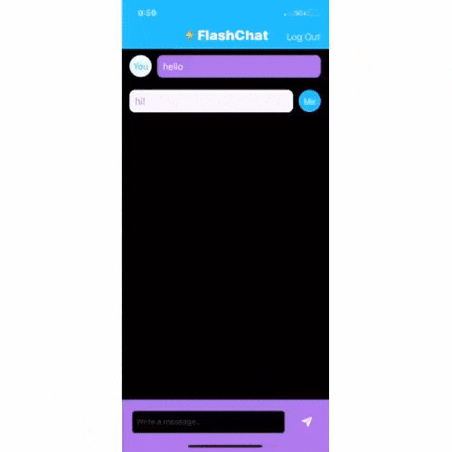

# Flash-Chat
This app was created as a part of a [Udemy course](https://www.udemy.com/share/101WsWAEMScldUQn8F/) I am taking (April/May 2020). 

The goal was to create a chat app with a Firebase Firestore backend database to store and retrieve messages from the cloud. While it's arguably quite deprecated (doesn't separate messages from different users, for instance), I learned a ton about Table Views, Cocoapods, and Firebase.

Within the constants file, I additionally created a function to push an alert message to the user on error which was not included in the lessons (login, error retrieving Firestore data, etc.).

## Lesson Objectives

* How to integrate third party libraries in your app using Cocoapods and Swift Package Manager.
* How to store data in the cloud using Firebase Firestore.
* How to query and sort the Firebase database.
* How to use Firebase for user authentication, registration and login.
* How to work with UITableViews and how to set their data sources and delegates.
* How to create custom views using .xib files to modify native design components.
* How to embed View Controllers in a Navigation Controller and understand the navigation stack.
* How to create a constants file and use static properties to store Strings and other constants.
* Learn about Swift loops and create animations using loops.
* Learn about the App Lifecycle and how to use viewWillAppear or viewWillDisappear.
* How to create direct Segues for navigation.
>This is a companion project to The App Brewery's Complete App Developement Bootcamp, check out the full course at [www.appbrewery.co](https://www.appbrewery.co/)

## Final Result

